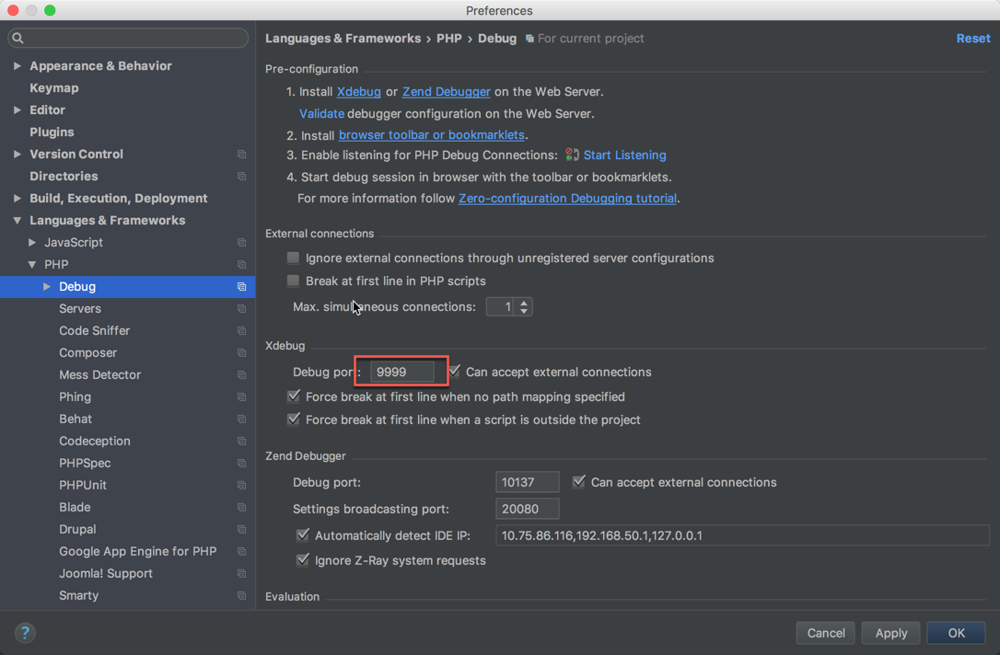
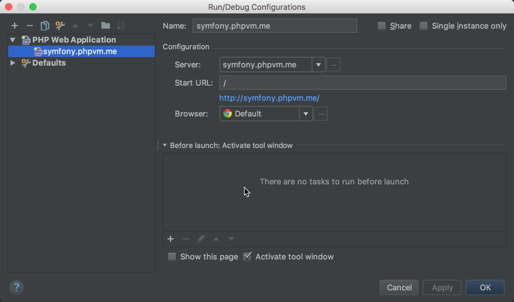
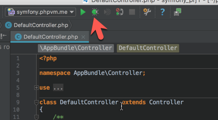
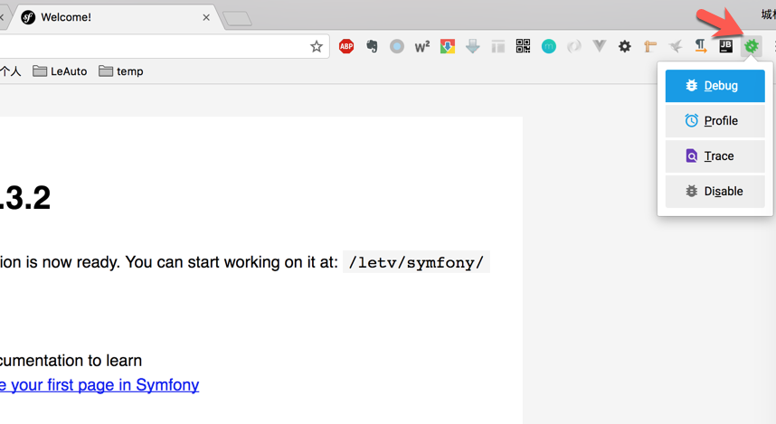

# 简介

`php-dev-vm`可以帮助快速构建`PHP`虚拟机开发环境。你也可以修改`Vagrantfile`，定制自己的`PHP`虚拟机开发环境。

# 解决什么问题

多人团队开发环境不同步一般带来如下问题：

- 不同电脑上单独安装配置占用时间，后续解决环境配置、依赖等问题也会占用较多工作时间，团队越大问题越突出
- 没有标准安装、配置步骤，不同工程师水平不一致，每次环境配置的最终结果可能不一致，最终导致开发时存在潜在调试、运行等问题，解决办法也无法快速在团队中应用
- 环境安装配置对新人是障碍，耽误熟悉业务代码时间，资深工程师帮助新人配置环境也占用时间
- 开发环境后续调整、同步也是障碍

# 做什么 - 为什么使用VM，而不是Docker

如果能够实现自动化的构建开发环境，通过指定的分发机制同步开发环境配置，就可以很好解决以上问题。

通过`Vagrant`这个工具自动化构建开发环境虚拟机镜像，将开发环境需要的软件、配置打包到镜像中，然后通过`Rsync`或者`FTP`分发镜像，可以实现这一点，满足我们的需求。

至于为什么不使用 **PHP Docker镜像**，是因为目前生产环境中PHP程序运行在虚拟机中，迁移不是短时间就能完成的事情。

# 怎么做 - 使用`Vagrant`制作PHP虚拟机开发环境

可以通过本项目快速构建PHP虚拟机开发环境。

## 依赖软件

- macOS Sierra Version 10.12.5
- `homebrew`
- `vagrantup`
- `virualbox`

## 安装依赖Vagrant Box

Install CentOS 7.2 box

```sh
> vagrant box add "CentOS-7.2-x64" https://github.com/CommanderK5/packer-centos-template/releases/download/0.7.2/vagrant-centos-7.2.box
```

## 如何构建PHP开发环境Vagrant Box

### 构建`php-dev-vm-5.6.30.box`

编写`Vagrantfile`:

见[这里](./src/PHP-5.6.30/Vagrantfile)

构建`Vagrant Box`:

```sh
> # start vm
> vagrant up

> # config mysql root password
> mysql_secure_installation
> # todo: add more config statements

> # create vagrant box
> vagrant package --output "php-dev-vm-5.6.30.box" $(vagrant global-status | grep 'src/PHP-5.6.30' | awk '{print $1}') && mv php-dev-vm-5.6.30.box ../../box/
```

### 构建`php-dev-vm-7.1.5.box`

//待完成


# 基于`php-dev-vm-5.6.30.box`定制`Symfony`开发环境

```sh
# 首先，构建 php-dev-vm-5.6.30.box

# 把 Symfony Application 的项目文件放在和 `php-dev-vm` 的平级目录 `symfony_prj1` 中

> cd work/php56-symfony
> vagrant box remove "../../box/php-dev-vm-5.6.30.box" || true && vagrant up  # ignore error when box not exists

> # 在电脑的 "/etc/hosts" 文件中增加如下配置
> # 192.168.50.5 host.phpvm.me
> # 192.168.50.5 symfony.phpvm.me

> # 浏览器中访问 http://symfony.phpvm.me http://host.phpvm.me/php-info.php ，能正常打开页面
```

配置PHPStorm调试：

- 修改`xdebug`的监听端口为`9999`
  
- 启动调试有两中方法
  - 方法1
    - 配置`Run/Debug Configurations`
      
    - 以`Debug`方式运行`symfony.phpvm.me`
      
  - 方法2
    - 安装Chrome插件`xdebug helper`、`JetBrains IDE Support`
    - PHPStorm中，设置断点，点击`Start Listening for PHP Debug Connetions`
    
    - 浏览器中打开`http://symfony.phpvm.me`，`xdebug helper`打开`debug`
    
    - PHPStorm进入调试模式
    

# References

- Vagrant: https://www.vagrantup.com/docs/index.html
- Discover Vagrant Boxes
  - https://atlas.hashicorp.com/boxes/search
  - http://www.vagrantbox.es/
- Nginx配置
  - [Nginx Beginner's Guide](http://nginx.org/en/docs/beginners_guide.html)
  - [Setting up PHP-FastCGI and nginx? Don’t trust the tutorials: check your configuration!](https://nealpoole.com/blog/2011/04/setting-up-php-fastcgi-and-nginx-dont-trust-the-tutorials-check-your-configuration/)
  - [nginx和php-fpm基础环境的安装和配置](https://segmentfault.com/a/1190000003067656)
- PHP-FPM配置
  - FastCGI 进程管理器（FPM）配置：http://php.net/manual/zh/install.fpm.configuration.php
  - https://www.nginx.com/resources/wiki/start/topics/examples/phpfcgi/
- PHP Function Reference／扩展列表
  - http://php.net/manual/en/funcref.php
- [Debugging with PhpStorm](https://confluence.jetbrains.com/display/PhpStorm/Debugging+with+PhpStorm)
